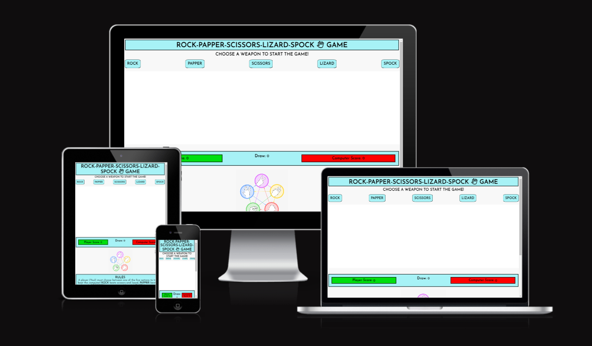
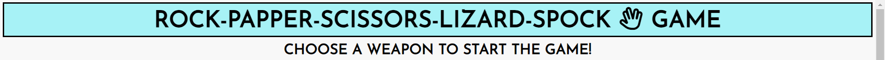
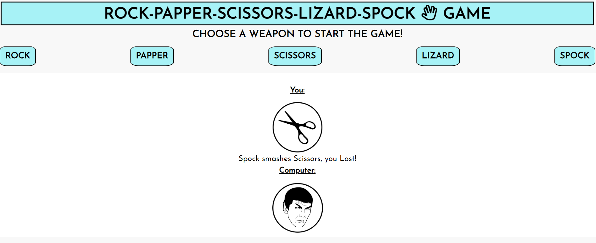
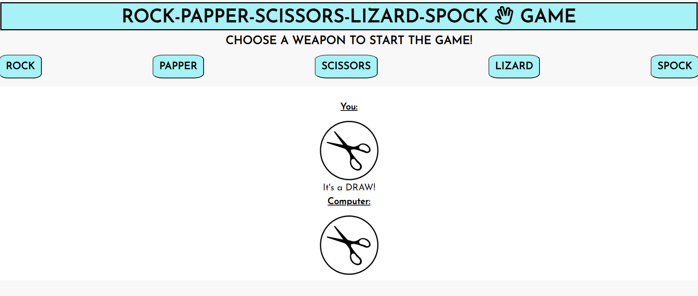
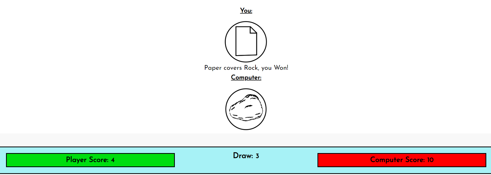

# Rock - Paper - Scissors - Lizard - Spock - Game

- [R-P-S-L-S](https://lfg115.github.io/rock-paper-scissors-L-S/) This amazing fun twist on the simple rock, paper, scissors game  
  and adds new thoughts, decitions and ideas to playing against the computer in this 1 v 1 scenario game.
  
- This fun interactive game is based on the hit T.V show "The Big Bang Theory". The site is aimed towards fans of the show and
  people who would would like to play a more complex game of Rock, Paper, Scissors.

- 

## Features

### Header

- Sitting at the top of the page in a soft blue colour with a clear font and bold black letters so it makes for easy reading,
  Inside the title is also a favicon that shows the hand gesture made by spock himself.
- Just underneath the title is an instruction title, to get you on your way into the game as soon as you would like.
  

---

### Game Options

- In the "Weapon Choice" options the user has 5 buttons seperated evenly and clearly and are displayed just under the game command,
  These options are interactive buttons that allow you to make a clear and accurate decision for beating the computer.
- Once a button "Weapon" has been chosen the game will begin.
  To start another round straight after just repeat with a different choice or the same one.
   

---

### Game Result

- Once the user chooses there option a related image to the users choice will appear and so will the computers choice.
- Both options will be displayed on a clear white background to make sure there is no confution on the outcome.
  
- If the user wins there will be a "well done" message, an image of the option the user chose,
  and a small description on how the user won.
  

- If the user loses they will be shown a "you lose" message, an image of the option the user chose,
  and a small desciption on how the user lost.
  

- With a "Draw" outcome the user gets a message stateing that exact information with both the matching images.
  

---
### Score Board

- The score board is set directly underneath the main game to keep a tally of the users wins, 
  the computers wins and the draw score. All this information is set into colour coded boxes which are easy to see
  and understand.  
  

---

### Rules 

- The rules section which is located at the bottom of the page inside the footer had a simple,
   clean and clear diagram image showing which option beats eachother.
- As well as that underneath the image are the rules in a seperate easyto read box in text form.
  Just so the user is perfectly clear and can make an informed descion before clicking there choice.
1[rules-img](assets/images/A7.png)

### Technology used

- HTML
- CSS
- Java Script
- Font Awesome icons
- Google fonts
- Favicon.io

---

