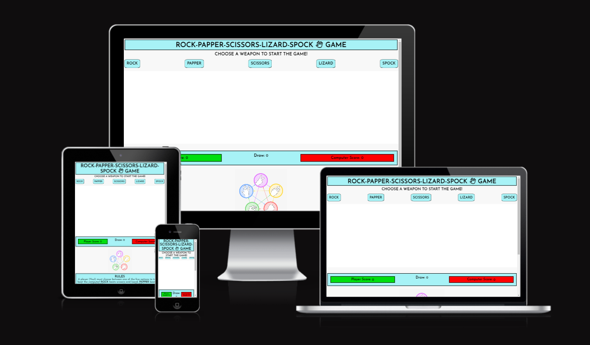
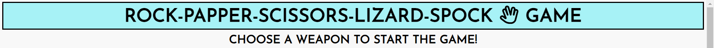
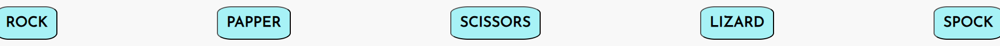
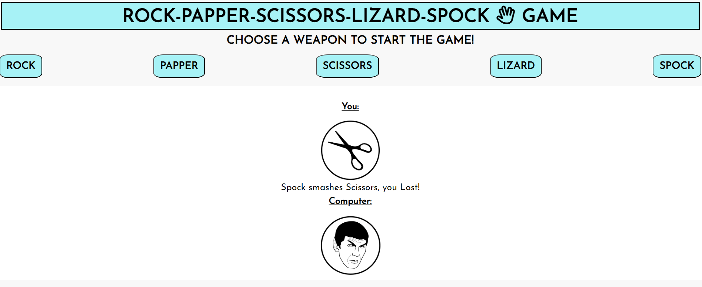
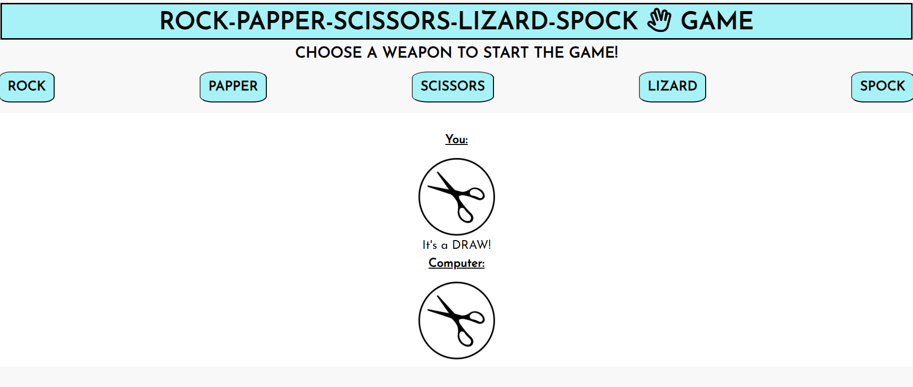
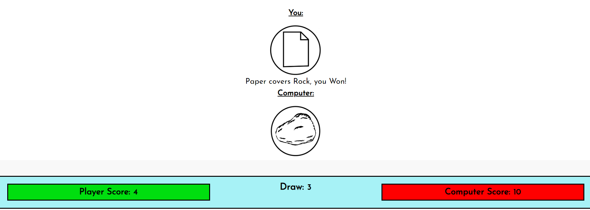
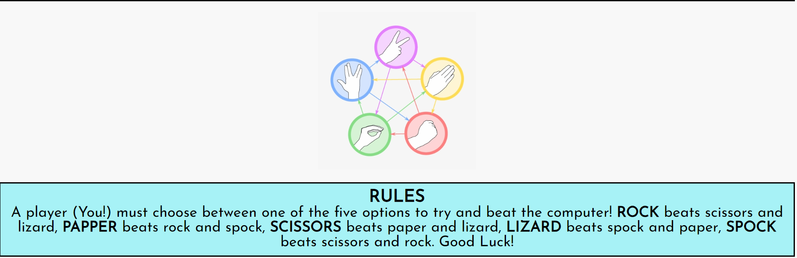
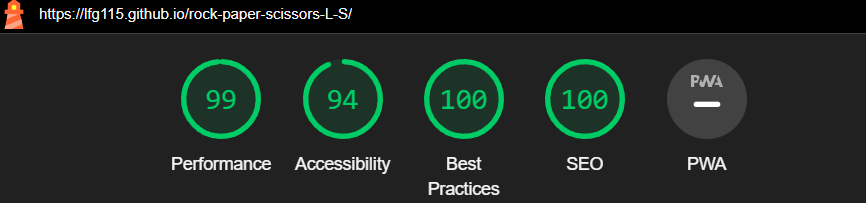
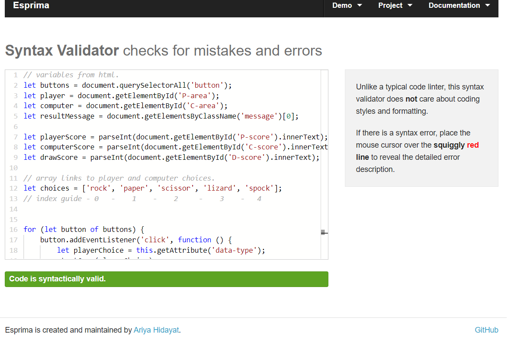

# Rock - Paper - Scissors - Lizard - Spock - Game

- [R-P-S-L-S](https://lfg115.github.io/rock-paper-scissors-L-S/) This amazing fun twist on the simple rock, paper, scissors game  
  and adds new thoughts, decitions and ideas to playing against the computer in this 1 v 1 scenario game.

- This fun interactive game is based on the hit T.V show "The Big Bang Theory". The site is aimed towards fans of the show and
  people of all ages who would would like to play a more complex game of Rock, Paper, Scissors.

- 

## Features

### Header

- Sitting at the top of the page in a soft blue colour with a clear font and bold black letters so it makes for easy reading,
  Inside the title is also a favicon that shows the hand gesture made by spock himself.
- Just underneath the title is an instruction title, to get you on your way into the game as soon as you would like.

  

---

### Game Options

- In the "Weapon Choice" options the user has 5 buttons seperated evenly and clearly and are displayed just under the game command,
  These options are interactive buttons that allow you to make a clear and accurate decision for beating the computer.
- Once a button "Weapon" has been chosen the game will begin.
  To start another round straight after just repeat with a different choice or the same one.

   

---

### Game Result

- Once the user chooses there option a related image to the users choice will appear and so will the computers choice.
- Both options will be displayed on a clear white background to make sure there is no confution on the outcome.
  
- If the user wins there will be a "well done" message, an image of the option the user chose,
  and a small description on how the user won.

  

- If the user loses they will be shown a "you lose" message, an image of the option the user chose,
  and a small desciption on how the user lost.

  

- With a "Draw" outcome the user gets a message stateing that exact information with both the matching images.

  

---

### Score Board

- The score board is set directly underneath the main game to keep a tally of the users wins, 
  the computers wins and the draw score. All this information is set into colour coded boxes which are easy to see
  and understand.
  
  

---

### Rules

- The rules section which is located at the bottom of the page inside the footer had a simple,
   clean and clear diagram image showing which option beats eachother.
- As well as that underneath the image are the rules in a seperate easyto read box in text form.
  Just so the user is perfectly clear and can make an informed descion before clicking there choice.

  

---

### Wireframe

- I have drafted sections and content on a paper sheet and then I have developed the actual content by employing the following layout stratgies:

Custom 

### Features to add

- When there is time I would like to add some more cool and iteresting features,
  such as sound effects/animations and maybe even add 2 more options. e.g plastic bag / boot.

- Also would like to add a"Leave" button to end the game.
  
---

### Technology used

- HTML
- CSS
- Java Script
- Font Awesome icons
- Google fonts
- Favicon.io

---

### Testing

- I have tested playing this game on different browsers: Chrome & Safari.

- I can confirm that the game results are always correct.

- I can confirm the header, gamearea, score area and the rules area are all readable and easy enough to understand.
  
- I can confirm that all colours and fonts are easy to read and are accessible by running it through devtools.

  

- I can confirm that this project is responsive, looks good and works on all screen sizes with mediaQ.

---

### Validator testing

#### HTML

- No errors or warnings were found when using the official W3C validator.

#### CSS

- No errors or warnings were found when using the official W3C (Jigsaw) validator.

#### JS

- When I placed my JS work into the validator that was given to me I had warnings.
- 11 - 'let' is available in ES6 (use 'esversion: 6') or Mozilla JS extensions (use moz).
- I did my JS in a different validator and it came out with no warninngs or errors.

  

---

### Bugs

#### unfixed

- I am aware of some uneven parts in the score board area,
  on mobile devices where some more styles could be done to tidy up the text.

#### fixed

- The main bugs I had to fix were to do with image cache in the rules section, and the colour transitions making sure they worked,
  and could read well.

---

### Deploymeant

- The website was deployed to GitHub pages and is accessed by this link: [HERE](https://lfg115.github.io/rock-paper-scissors-L-S/) 

---

### Credits

#### Content

- StackOverFlow has been a big help to me with getting some sort of understanding with JS.
- W3schools has been the main source of Information.
- Some code I used and referred from the [Love-Maths-Project](https://lfg115.github.io/love-maths/)
- Some code I used and referred from the [Beauty-Cabin-Project](https://lfg115.github.io/beauty-cabin/index.html)

#### Media

- Images taken from google images, wikipidia and slack and free to use.
  
##### shoutout

- help from [supersimpledev](https://www.youtube.com/@SuperSimpleDev/videos)
- help from [fireship](https://www.youtube.com/@Fireship)